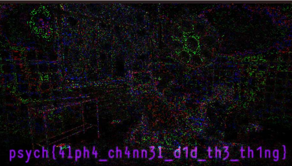

# Cold Case

We were given two images, and in the challenge description, it was written that the two images on their own mean nothing, but together they can reveal the truth. 

To solve this, I used Stegsolve to combine the images. For beginners, here is the step-by-step process used to extract the hidden data:
1. Open the first image in Stegsolve.
2. Navigate to `Analyze` > `Image Combiner` in the top menu.
3. Select the second image when prompted.
4. Click through the arrows at the bottom of the window to cycle through different mathematical operations until you reach the `XOR` function.

The XOR of the two images combined their pixel data to reveal the following image:

The final flag obtained was `psych{41ph4_ch4nn3l_d1d_th3_th1ng}`.

**Author: Krish Barwar**