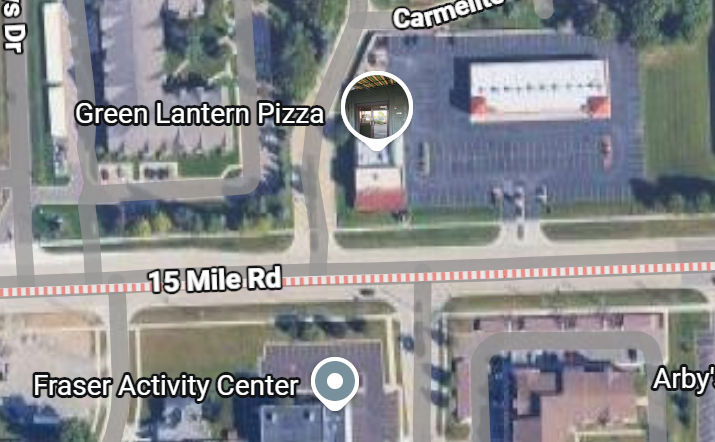
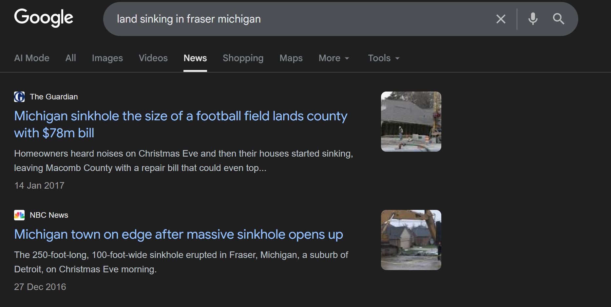
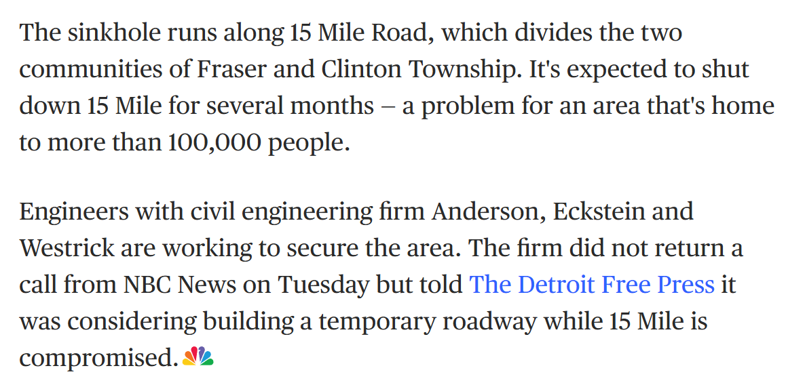
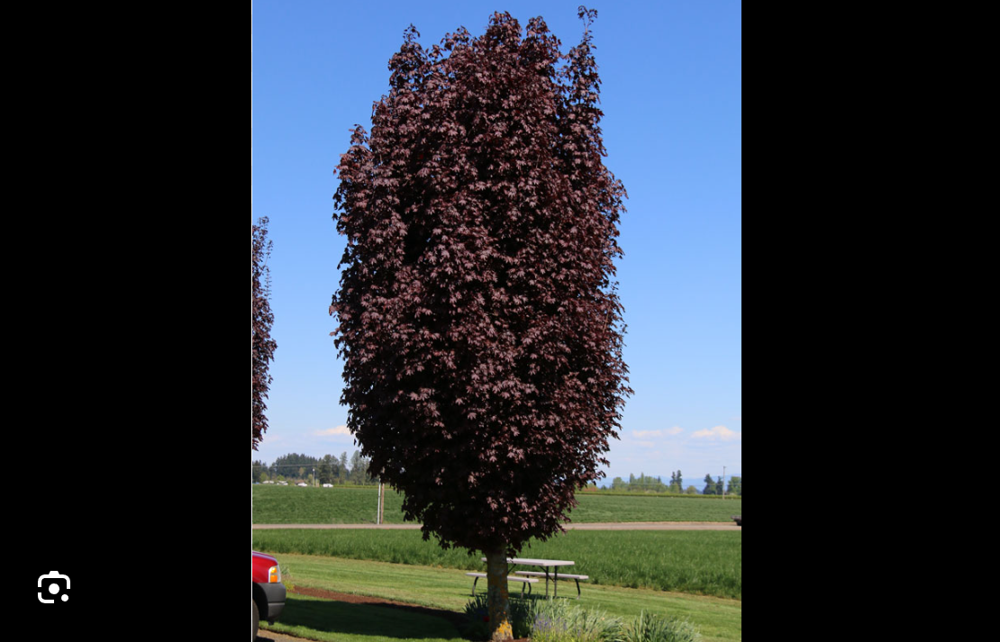

# Sentinel Tree

**Objective:** The challenge provided a cryptic four-line riddle, and the goal was to find the exact geographical coordinates of the location it described.

**The Riddle:**
> "In a cloven Sweetwater peninsula, seek the heraldic twin of the winter strawberry capital. 
> Trace a surveyor's track matching a Grand Slam’s opening tally to where a jade beacon hawks hearth-blistered disks. 
> Look across the asphalt to a suburban Pompeii—a silent crater that swallowed the earth whole just as the Advent calendar closed. 
> Rewind the digital lens to a forgotten harvest, and pinpoint where the crimson sentinel's trunk pierced the doomed soil." 

### Step 1: Decoding the Location
I broke down the first line of the riddle. A Google search revealed that the "winter strawberry capital" is Plant City, Florida. 
The clue then asked for its "heraldic twin." Researching crests, I found that the Fraser clan features a strawberry on its crest. Fraser also happens to be a city in Michigan, USA. Checking the map, Fraser is situated near a peninsular region surrounded by the Great Lakes (Sweetwater lakes), confirming I was on the right track.

### Step 2: The Track and the Beacon
Next, I analyzed the second line: "matching a Grand Slam’s opening tally". In tennis (a Grand Slam sport), the scoring goes 15, 30, 40, making the opening tally **15**. 
Because the task was to find coordinates, I scanned the map of Fraser for the number 15 and found **15 Mile Road** at the top of the map. 

Along this road, I needed to find a "jade beacon [that] hawks hearth-blistered disks". "Jade" means green, and "hearth-blistered disks" is a clever way of describing pizzas. I spotted **Green Lantern Pizza** on 15 Mile Road—a perfect match! 

### Step 3: The Suburban Pompeii
The third line instructed to "Look across the asphalt to a suburban Pompeii—a silent crater...". "Across the asphalt" clearly meant looking across the street. 
The "silent crater" that "swallowed the earth" implied a sinkhole or land subsidence. The riddle also gave a timeframe: "just as the Advent calendar closed". I googled "land sinking in fraser michigan" and discovered news articles about a massive sinkhole that opened up along 15 Mile Road on **December 24-27, 2016** (right around Christmas, the end of the Advent calendar).

### Step 4: Rewinding the Lens
The final line said to "Rewind the digital lens to a forgotten harvest". This meant using Google Earth's historical imagery feature. 
I looked at the imagery across the road from Green Lantern Pizza between October 2016 and April 2017 to observe the sinkhole site. 

The riddle asked to find the "crimson sentinel's trunk". A "crimson sentinel" refers to a specific type of tree called a **Crimson Sentry Maple**, which has striking red leaves during the autumn/winter harvest season.
