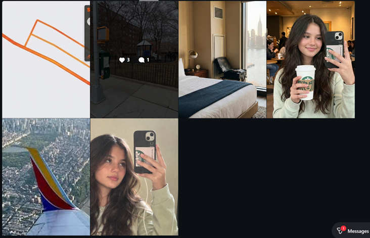
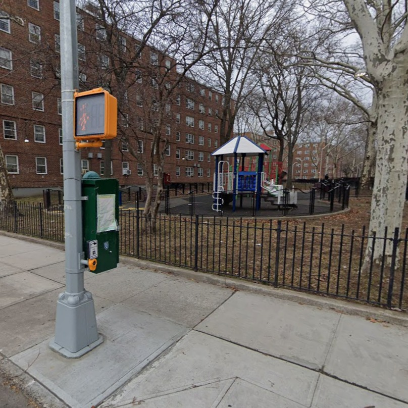
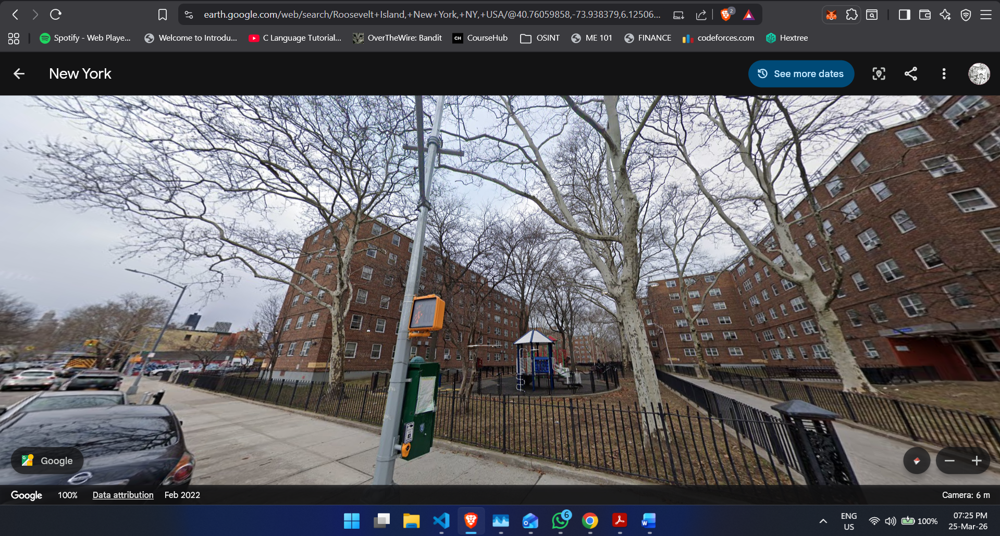

# CTF Writeup: The Digital Trail

**Category:** OSINT / Geolocation
**Objective:** Find the exact coordinates of the park where the target stopped to take a photo during her evening commute.

---
Author: KUSHAL N, IITG
## 1. The Starting Point
The challenge started with a single image: a boarding pass for a passenger named **Chloe A Whitman**, flying from Worcester (ORH) to LaGuardia (LGA) on March 2nd via Delta Airlines.

Using the name on the pass, a quick search led me directly to her Instagram profile: `ch_whitman`.

## 2. Piecing Together the Timeline
Looking at her feed, I was able to put together a clear timeline of her day. All the posts related to the trip were made on March 2nd. 

Based on the photos, her afternoon and evening looked like this:
1. She travels from Worcester to NYC.
2. She checks into a hotel (the view matches the Graduate by Hilton on Roosevelt Island).
3. She goes for an evening bike ride.
4. She stops at a small park and takes a photo at dusk.
5. She goes back to her room and posts a screenshot of her Strava route.

## 3. Narrowing the Search Area
The caption on her Strava post explicitly said **"Roosevelt Island Commute"**, which gave me a very tight search area.

I looked at the partial map in her Strava screenshot. By comparing the length and colour gradient of the orange route lines to the actual map of Roosevelt Island, I was able to figure out her general path along the roads, and potential places where she might have stopped.

## 4. The Top-Down Advantage
Now I just had to find the exact park. The photo she took at dusk had a few key details:

* A small playground structure with a blue and white roof.
* A pedestrian crossing signal right next to the park fence.
* Red brick apartment buildings in the background.

Roosevelt Island has several small parks and playgrounds that look similar, and checking every single one on Street View would have been tedious. 

Then I realized the most important clue: **the trees in her photo had completely bare branches.** It was clearly autumn or winter. 

This gave me a huge advantage. If you use standard Google Maps satellite view, the summer leaves completely block your view of small parks. To get around this, I opened Google Earth Pro and used the historical imagery tool to switch the map to an autumn timeframe.

With the leaves gone, I had a perfectly clear, unobstructed view of the ground. I followed her projected Strava path from above and specifically looked at areas next to crosswalks. The blue and white hexagonal roof of the playground stood out immediately from the top-down view, right next to the crossing and the red brick buildings. 

Coordinates found: 40.76059858,-73.938379, challenge solved!