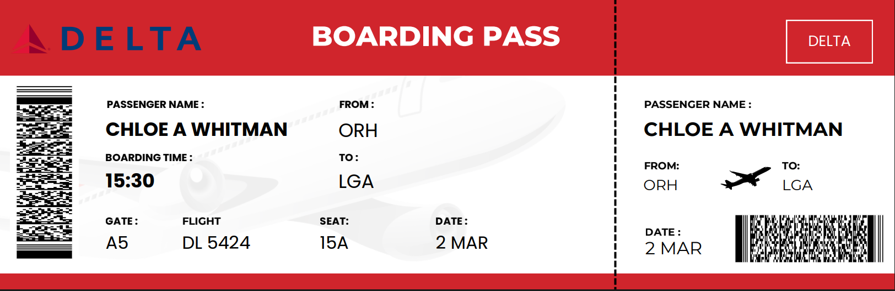

# The Digital Trail

**Objective:** We were given a boarding pass and were expected to find the coordinates of the place where she started to enjoy her journey and remember her childhood.

### Step 1: Initial OSINT on the Boarding Pass
We started by analyzing the provided boarding pass.

From the boarding pass, I searched for the passenger name "Chloe A Whitman" and reached her Instagram 
* **Instagram Profile:** `https://www.instagram.com/ch_whitman/`

### Step 2: Timeline and Story Analysis
Upon investigating her Instagram account, I found several recent posts. All the posts were made on 2nd March. 

After seeing the chronology, I understood the story: Chloe goes from Worcester to NYC, stays in a hotel, goes for an evening cycle where she stumbles upon a park that reminds her of her childhood, and then comes back to the room to post a Strava screenshot.

### Step 3: Following the Digital Crumbs
Initially, I noticed a photo of a Delta airlines plane wing. I got distracted trying to find the coordinates using FlightAware (`https://www.flightaware.com/live/flight/DAL5424/...`). 

After that didn't work, I focused my attention on the other posts. In the Strava post, it was written “Roosevelt Island Commute”. I searched for the similar road structure seen in the post and successfully found it on the map.

---
*Note: I successfully tracked the challenge up to this point during the CTF. The remainder of this write-up uses references from complete write-ups to demonstrate the final solution steps.*
---

### Step 4: The Seasonal Map Trick (Reference Solution)
Roosevelt Island has several small parks and playgrounds that look similar, and checking every single one on Street View would have been tedious. 

The most important clue was in the photo itself: the trees had completely bare branches, indicating it was autumn or winter. 

If you use standard Google Maps satellite view, the summer leaves completely block your view of small parks. To get around this, you can open Google Earth Pro and use the historical imagery tool to switch the map to an autumn timeframe.

With the leaves gone, there is a perfectly clear, unobstructed view of the ground. By following her projected Strava path from above and specifically looking at areas next to crosswalks, a playground with a blue and white hexagonal roof stands out immediately from the top-down view, right next to the crossing and the red brick buildings. 

**Coordinates found:** 40.76059858, -73.938379
### Learnings & Probable Mistakes
Reflecting on why I couldn't find the exact flag during the event, I noted a few key areas for improvement:
* **Pacing the Search:** Instead of patiently following her entire path on the map, I started searching broadly for parks and playgrounds in the region. Because the park in the image was not named, I missed it using this unstructured approach.
* **Utilizing Environmental Clues:** Even if the park was unnamed, I should have paid attention to the season. Since it was clearly autumn in the photo, I should have tried changing the timeline in Google Earth, as this specific park is covered by tree canopies in other seasons.

**Author:krishbarwar07-lang**